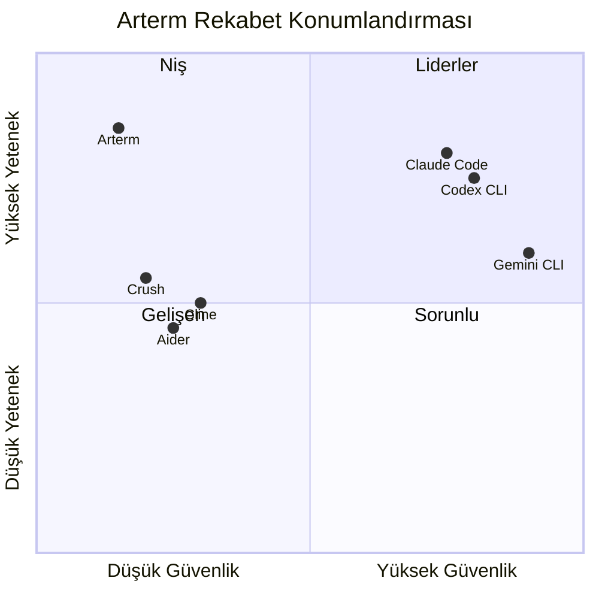

# Arterm: Derinlemesine Analiz ve Rekabet Raporu

> **Tarih:** 2026-08-13
> **Yöntem:** 3 paralel swarm agent (websearch) + manuel kod analizi (grep ile doğrulandı)
> **Kod tabanı:** 83 crate · 709K satır Rust · 30+ tool · 38+ provider

---

## Kullanıcı İsteği

Derinlemesine proje incelemesi yap, multiagent yapısını kullanarak piyasadaki CLI agent'larla karşılaştır, eksiklikleri ve eklenebilecek özellikleri tespit et.

---

## 1. DOĞRULANMIŞ MEVCUT DURUM

### Arterm'in Güçlü Yanları (kod doğrulandı)

| Özellik | Doğrulama |
|---|---|
| **Swarm / Multi-Agent** | Task DAG, deep/light mode, kanallar, DM'ler, recursive spawning (swarm-deep mode) |
| **38+ Provider** | Anthropic, Gemini, Bedrock, OpenRouter, Copilot, Cursor, Antigravity + 38 OpenAI-compatible |
| **Memory Graph** | Local embeddings (all-MiniLM-L6-v2) + petgraph DiGraph + cascade retrieval + sidecar judge |
| **Browser tool** | status/setup/snapshot/click/type/scroll/screenshot/eval/fill_form/upload/press |
| **Self-dev mode** | Build queue, coordinated build-reload, test, cancel-build |
| **Session replay** | Video export (fps/cols/rows), timeline editing, swarm synchronized replay |
| **ACP adapter** | Protocol v1, Standard/Extended/Full profiles, session new/load/prompt/cancel/close/set_model |
| **Lifecycle hooks** | turn_start/end, session_start/end, pre_tool (gate), post_tool — command-based |
| **Conversation rewind + undo** | `/rewind N` + `/rewind undo` — mesaj bazlı geri alma |
| **Reasoning effort kontrolü** | `openai_reasoning_effort`, `anthropic_reasoning_effort`, `openai_service_tier` config |
| **AgentGrep structural outline** | Regex-based structural analysis (Rust/TS/JS/Python/Markdown) — tree-sitter DEĞİL |
| **System prompt layering** | Base + AGENTS.md + prompt-overlay + preferred-tools + memory + skills |
| **Ambient mode** | Proactive background agent, memory gardening, self-scheduling |
| **Initiative tracking** | Durable milestones with progress tracking |
| **Gmail, Debug socket, Side panel, Skills, Schedule, Batch** | Hepsi kod doğrulandı |

### İlk Raporda Yanlış Olduğu Düşünülen Ama Aslında VAR Olanlar

| Özellik | Gerçek Durum |
|---|---|
| **Conversation undo** | ✅ VAR: `/rewind N` + `/rewind undo` TUI'de çalışıyor |
| **ACP support** | ✅ VAR: `arterm acp` Standard/Extended/Full profilleri |
| **Permission system** | ✅ KISMEN: `request_permission` tool var, ambient safety system tasarlanmış, `pre_tool` gate hook var |
| **Reasoning effort** | ✅ VAR: Config'de `openai_reasoning_effort` / `anthropic_reasoning_effort` |
| **Structural code analysis** | ✅ KISMEN: AgentGrep outline mode (regex-based, 5 dil) — ama LSP değil |

---

## 2. DOĞRULANMIŞ KRİTİK EKSİKLER

### P0 — Endüstri Standardı, Kesinlikle Yok

#### 1. OS-Level Sandboxing ❌
**Doğrulama:** Kod tabanında `landlock`, `seccomp`, `seatbelt`, `sandbox-exec` = 0 match. README: "there is no sandbox."

**Rakipler:** Gemini CLI (5 yöntem), Codex (Seatbelt/seccomp/landlock), Claude Code (OS-level), Copilot (local+cloud), OpenHands (Docker)

**Etki:** Enterprise ve unattended kullanım için bloklayıcı.

#### 2. Plan Mode (Read-Only Exploration) ❌
**Doğrulama:** Swarm'da `plan_mode: "deep"/"light"` var ama bu swarm planlama stratejisi. Claude Code tarzı "önce keşfet, plan üret, kullanıcı onayla, sonra düzenle" modu YOK.

**Rakipler:** Claude Code, Copilot CLI, Cline, OpenCode, Kiro CLI

### P1 — Güçlü Fark Yaratan Eksikler

#### 3. File-Level Checkpoint/Undo ❌
**Doğrulama:** Conversation-level rewind var AMA dosya içeriği snapshot'ı yok. `apply_patch` orijinal içeriği okuyor ama kaydetmiyor. Agent dosyayı bozarsa, sadece conversation rewind yardımcı olabilir.

**Rakipler:** Aider (auto-commit ile), Cline (checkpoint/undo sistemi), Claude Code (git checkpoint)

#### 4. Git Auto-Commit ❌
**Doğrulama:** Edit sonrası otomatik git commit yok. Aider her anlamlı düzenleme sonrası commit atıyor.

**Etki:** Hata durumunda geri dönüş zor. Değişiklikleri takip etmek kullanıcının sorumluluğu.

#### 5. LSP Integration ❌
**Doğrulama:** `tree_sitter`, `lsp_client`, `language_server` = 0 match. AgentGrep regex-based structural analysis yapıyor (5 dil: Rust/TS/JS/Python/Markdown) ama gerçek LSP değil. Go-to-definition, find-references, type errors yok.

**Rakipler:** Crush (gopls, TypeScript LSP, nil), Claude Code (LSP tool)

#### 6. Custom Agent Definitions ❌
**Doğrulama:** `.arterm/agents/*.md` formatı yok. AGENTS.md var ama bu instruction loading, reusable agent persona tanımları değil. Swarm worker'lar spawn edilebilir ama "model + tool set + system prompt" tanımlı kalıcı agent'lar yok.

**Rakipler:** Claude Code (`.claude/agents/*.md`), Codex (`.codex/agents/*.toml`), Copilot, Kiro, Cline

#### 7. Granular Permission Rules ❌
**Doğrulama:** `arterm-command-risk` blast-radius sınıflandırması yapıyor. `pre_tool` hook gate olarak çalışıyor. Ama `Tool(Bash(npm run *))` tarzı parametre-level izin kuralları ve `deny → ask → allow` precedence yok.

**Rakipler:** Claude Code (`Tool(specifier)` syntax), Codex (`granular` policy)

#### 8. Worktree Isolation Tool ❌
**Doğrulama:** Swarm mimarisinde worktree manager concept var (SWARM_ARCHITECTURE.md) ama tool olarak expose edilmemiş.

**Rakipler:** Claude Code (`EnterWorktree`/`ExitWorktree`)

### P2 — İleri Seviye Eksikler

| # | Eksik | Doğrulama | Rakipler |
|---|---|---|---|
| 9 | **Auto-Memory** | Agent manuel `memory remember` çağırmalı | Claude Code (otomatik MEMORY.md) |
| 10 | **HTTP/Webhook Hooks** | Sadece command hooks var | Claude Code (5 hook türü) |
| 11 | **Prompt/Agent Hooks** | LLM-powered permission kararları yok | Claude Code |
| 12 | **Monitor Tool** | `bg` var ama reactive event injection yok | Claude Code |
| 13 | **Repo Map** | AgentGrep outline var ama repo-wide map yok | Aider, Crush |
| 14 | **GitHub/Slack/Linear** | Gmail var, diğerleri yok | Codex, Claude Code, Devin |
| 15 | **Cloud Execution** | iOS + desktop2 var ama cloud exec yok | Codex, Devin, Copilot |
| 16 | **Config Profiles** | `--profile` yok | Codex |

---

## 3. RAKİP KONUMLANDIRMA MATRİSİ

| Özellik | Arterm | Claude Code | Codex CLI | Gemini CLI | Crush | Aider | Cline |
|---|---|---|---|---|---|---|---|
| **Sandboxing** | ❌ | ✅ OS | ✅ OS | ✅ 5 yöntem | ❌ | ❌ | ❌ |
| **Plan Mode** | ❌ | ✅ | ❌ | ❌ | ❌ | ❌ | ✅ |
| **Multi-Agent/Swarm** | ✅✅ DAG | ✅ Teams | ✅ Subagent | ❌ | ❌ | ❌ | ✅ Teams |
| **MCP** | ✅ | ✅ | ✅ | ✅ | ✅ | ❌ | ✅ |
| **ACP** | ✅ Adapter | ✅ | ✅ | ❌ | ❌ | ❌ | ❌ |
| **Memory** | ✅✅ Graph | ✅ Auto | ✅ TOML | ❌ | ❌ | Repo map | ✅ |
| **Browser** | ✅ | Chrome | ✅ | ❌ | ❌ | ❌ | ❌ |
| **LSP** | ❌ | ✅ | ❌ | ❌ | ✅ | ❌ | ❌ |
| **Provider çeşitliliği** | ✅✅ 38+ | Sınırlı | Sınırlı | 1 | ✅ 25+ | ✅ | ✅ |
| **Custom Agents** | ❌ | ✅ | ✅ | ❌ | ❌ | ❌ | ✅ |
| **Git Auto-commit** | ❌ | ❌ | ❌ | ❌ | ❌ | ✅ | ❌ |
| **File Undo** | ❌ | ✅ | ❌ | ❌ | ❌ | ✅ commit | ✅ |
| **Hooks** | ✅ Command | ✅ 5 tür | ✅ Command | ❌ | ✅ | ❌ | ✅ |
| **Reasoning Effort** | ✅ | ✅ | ✅ 7 level | ❌ | ❌ | ❌ | ❌ |
| **Skills** | ✅ | ✅ | ✅ | ✅ Extensions | ✅ | ❌ | ✅ |
| **OSS / Dil** | ✅ Rust | ❌ TS | ✅ Rust | ✅ TS | ✅ Go | ✅ Python | ✅ TS |

---

## 4. ÖNCELİKLENDİRİLMİŞ AKSİYON PLANI

### Faz 1: Temel Güvenlik (1-2 hafta) — En kritik
1. **Landlock/seccomp sandboxing** (Linux) → workspace-write/danger-full-access modları
2. **macOS Seatbelt** (sandbox-exec) → aynı modlar
3. **Plan mode** → read-only exploration + kullanıcı onayı + sonra execute

### Faz 2: Geliştirici Güveni (2-4 hafta)
4. **File-level checkpoint** → edit öncesi shadow copy, `arterm undo` komutu
5. **Git auto-commit** → her anlamlı düzenleme sonrası otomatik commit
6. **Granular permission rules** → `Tool(specifier)` syntax, deny→ask→allow
7. **Custom agents** → `.arterm/agents/*.md` (model + tools + prompt)

### Faz 3: Derin Kod Anlayışı (4-8 hafta)
8. **LSP integration** → tree-sitter parsing + LSP client (type errors, go-to-def)
9. **Repo-wide map** → structural codebase summary (Aider tarzı)
10. **Worktree isolation tool** → paralel güvenli çalışma
11. **Auto-memory** → turn sonunda otomatik öğrenim extraksiyonu

### Faz 4: Ekosistem (8-12 hafta)
12. **GitHub PR/Issue tool** → Slack/Linear webhook tools
13. **HTTP + Prompt hooks** → webhook + LLM-powered permission
14. **Monitor tool** → reactive background command watching
15. **Config profiles** → `--profile` ile farklı setup'lar
16. **Cloud execution** → local↔cloud handoff

---

## 5. STRATEJİK SONUÇ

**Arterm benzersiz pozisyonu:** En yüksek yetenek (swarm DAG, 38+ provider, memory graph, browser, replay), ama en düşük güvenlik.

**Kritik yol:** Sandboxing + Plan Mode eklenirse Arterm leader quadrant'a geçer. Bu ikisi olmadan, yüksek yetenek güvenlik riski taşıyor.

**En yakın rakip:** Codex CLI — aynı Rust + açık kaynak, ama sandbox + LSP + cloud ile önde. Arterm swarm + provider + memory + browser ile önde.

---

*3 paralel swarm agent tarafından araştırıldı. Tüm iddialar kod tabanında grep/read ile doğrulandı. Araştırma raporları: `competitor-research-report.md`, `competitor-research-claude-code-vs-codex-cli.md`*
