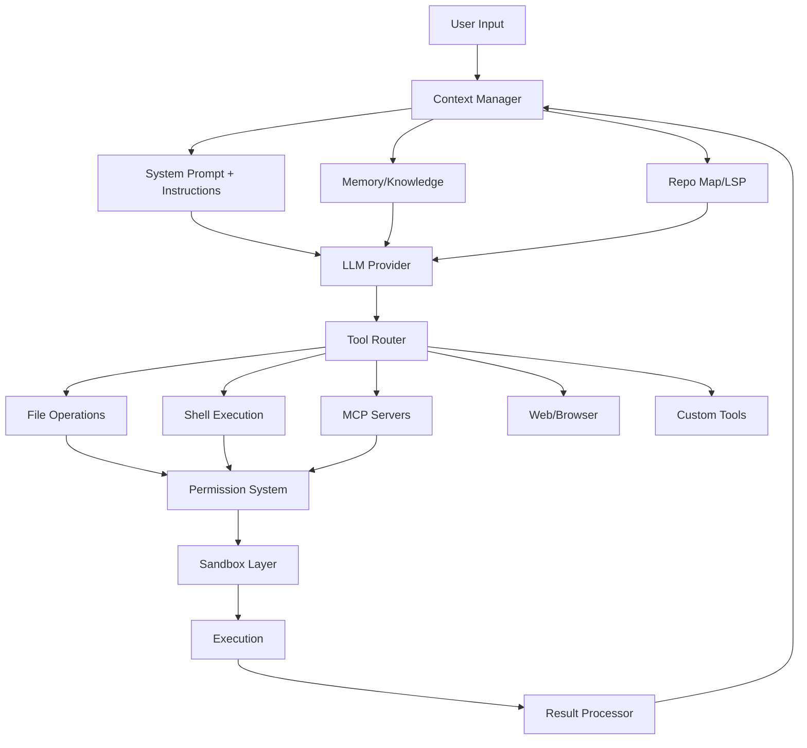

# Competitor Coding Agent Research Report
## Feature Gap Analysis for Arterm

**Date:** 2026-08-13
**Researcher:** Arterm Agent
**Purpose:** Identify feature gaps and competitive positioning opportunities

---

## Executive Summary

The terminal AI coding agent landscape has rapidly matured and consolidated in 2025-2026. Key industry shifts include:

- **Windsurf was acquired by Cognition (Devin)** and rebranded as "Devin Desktop"
- **Amazon Q Developer CLI** was deprecated and reborn as **Kiro CLI** (closed-source)
- **Gemini CLI** is transitioning to **Antigravity CLI** (June 2026)
- **ACP (Agent Client Protocol)** has emerged as a universal agent interoperability standard
- **MCP (Model Context Protocol)** is now table stakes across every agent
- **Skills** (reusable instruction packages, via agentskills.io standard) are proliferating
- **Multi-model support** is universal - no agent is single-model anymore

Most agents converge on a core feature set: file operations, shell execution, MCP integration, multi-model, plan mode, session persistence, and permission systems. Differentiation now comes from **sandboxing depth, agent orchestration, cloud integration, and developer experience**.

---

## Detailed Tool Profiles

---

### 1. Google Gemini CLI (→ Antigravity CLI)

| Attribute | Detail |
|---|---|
| **Open Source** | ✅ Apache 2.0 |
| **Language** | TypeScript / Node.js |
| **GitHub** | `google-gemini/gemini-cli` |
| **Models** | Gemini 3 Pro/Flash (1M context), transitioning |
| **Status** | Transitioning to "Antigravity CLI" June 2026 |

#### Key Features
- **Built-in tools:** Google Search grounding, file operations, shell commands, web fetching
- **MCP support:** Full MCP server integration (`@server` syntax)
- **Context files:** `GEMINI.md` for project-specific context
- **Checkpointing:** Save and resume conversations
- **Token caching:** Optimized token usage
- **Headless mode:** `--output-format json` and `stream-json` for scripting
- **GitHub Action integration:** Automated PR reviews, issue triage, `@gemini-cli` mentions
- **Custom commands:** User-defined slash commands
- **Extensions system:** Write and share custom extensions
- **IDE integration:** VS Code companion

#### Sandboxing (Best-in-class)
Gemini CLI has the most comprehensive sandboxing of any agent:
1. **macOS Seatbelt** (`sandbox-exec`) - 6 built-in profiles from permissive to strict
2. **Docker/Podman** - Full container isolation with custom images and Dockerfile support
3. **Windows Native Sandbox** - Uses `icacls` for integrity-level isolation
4. **gVisor/runsc** (Linux) - User-space kernel sandbox, strongest isolation
5. **LXC/LXD** (Linux) - Full-system container sandbox
6. **Tool-level sandboxing** - Granular isolation per tool execution
7. **Sandbox expansion** - Dynamic permission escalation system for failed commands
8. **Custom mounts** - `SANDBOX_MOUNTS` for external directory access

#### Authentication
- Google OAuth (free tier: 60 req/min, 1000 req/day)
- Gemini API Key (1000 req/day free)
- Vertex AI (enterprise)

#### Standout Feature
**Unrivaled sandboxing depth** with 5 different sandboxing technologies and tool-level sandboxing. The sandbox expansion system that proactively requests additional permissions is unique.

---

### 2. Amazon Q Developer CLI → Kiro CLI

| Attribute | Detail |
|---|---|
| **Open Source** | ❌ Was open source (MIT/Apache 2.0), now closed-source as Kiro CLI |
| **Language** | Rust (original), unknown (Kiro) |
| **GitHub** | `aws/amazon-q-developer-cli` (archived/unmaintained) |
| **Models** | Claude frontier models (via Kiro) |
| **Status** | Deprecated → Kiro CLI |

#### Key Features (Kiro CLI)
- **Custom agents:** Build task-specific agents with pre-defined tool permissions and prompts
- **Multi-step workflows:** Run multiple tasks in parallel with subagents
- **Headless mode:** `--print` for CI/CD pipeline automation
- **Steering files:** Project/team best practices and preferences
- **Code intelligence:** Advanced context management
- **Knowledge base:** Experimental knowledge management system
- **Agent skills:** Skill-based code intelligence
- **MCP support:** Native MCP integration
- **Hooks:** Pre/post command hooks for workflow automation
- **Auto-complete:** Context-aware command completion
- **ACP support:** Works with JetBrains, Eclipse, Zed, and other ACP IDEs
- **Planning agent:** Explore changes without modifying code
- **Conversation persistence:** Directory-based session management
- **Slash commands:** `/load`, `/save`, `/prompts`, `/usage`, `/model`, `/editor`

#### Standout Feature
**Agent steering** - systematic injection of team best practices and preferences into agent behavior. The **custom agents** system with per-agent tool permissions is well-designed.

---

### 3. GitHub Copilot CLI

| Attribute | Detail |
|---|---|
| **Open Source** | ❌ Proprietary |
| **Language** | Unknown (likely TypeScript/Go) |
| **Models** | Multi-model (Copilot models + BYO provider) |
| **Pricing** | Free tier included, AI Credits system |

#### Key Features
- **Interactive + programmatic modes:** `copilot` for interactive, `copilot -p` for headless
- **Plan mode:** Shift+Tab to cycle between ask/execute and plan modes
- **Cloud sandbox:** `copilot --cloud` for fully isolated cloud execution
- **Local sandbox:** `/sandbox enable` for filesystem/network restriction
- **Auto-compaction:** Automatic context compression at 95% token limit
- **Manual compaction:** `/compact` and `/context` commands
- **Copilot Memory:** Persistent repository understanding (conventions, patterns, preferences)
- **Custom agents:** Specialized versions for different tasks
- **Custom instructions:** Combined instruction files (no longer priority-based fallback)
- **Hooks:** Custom shell commands at key agent execution points
- **Skills:** Agent skills with instructions, scripts, and resources
- **MCP support:** Full MCP server integration
- **ACP support:** Expose Copilot CLI as an agent via ACP protocol
- **Trusted directories:** Control where CLI can read/modify/execute
- **Fine-grained tool approval:** `--allow-tool`, `--deny-tool`, `--allow-all-tools`
- **Steering during execution:** Enqueue messages, inline feedback on rejection
- **BYO model provider:** OpenAI-compatible, Azure, Anthropic, Ollama
- **GitHub integration:** Native PR creation, issue management, Actions workflows
- **Extended context:** Up to 1M token context window
- **Configurable reasoning levels**

#### Sandboxing
- **Local sandboxing:** `/sandbox enable` restricts filesystem, network, system capabilities
- **Cloud sandboxing:** `--cloud` runs in isolated cloud environment with state persistence
- Cloud sandbox policies inherit from Copilot cloud agent policies (firewall rules, etc.)

#### Standout Feature
**Cloud sandboxing with state persistence** - run sessions in the cloud that persist between uses, can be resumed from different machines, and run in parallel. **Copilot Memory** for persistent repository understanding is also unique.

---

### 4. Windsurf → Devin Desktop (Cognition)

| Attribute | Detail |
|---|---|
| **Open Source** | ❌ Proprietary |
| **Language** | TypeScript (IDE), Go/TypeScript (agents) |
| **Models** | SWE-1.6 Fast (free), Claude, GPT, Codex, Gemini, OpenCode |
| **Status** | Rebranded from Windsurf to Devin Desktop |

#### Key Features
- **Agent Command Center:** Manage fleets of local and cloud agents from one surface
- **Spaces:** Shared context and Git worktrees across all agents
- **Kanban view:** Track multiple agents working in parallel
- **Full IDE:** Built-in syntax highlighting, autocomplete, debugging
- **ACP support:** Work across models and agents (Claude Code, Codex, Gemini, OpenCode, Devin Local/Cloud)
- **Supercomplete:** Predicts next thought, not just next edit
- **Fast Context:** Millisecond codebase context finding
- **Agent diff review:** Rapidly or deeply review every agent diff
- **MCP servers:** Slack, Linear, Notion, Sentry, Stripe, Datadog, Atlassian, Figma, Vercel
- **Language servers:** rust-analyzer, clangd, gopls, Pyright
- **Extensions:** ESLint, Prettier
- **Background agents:** Custom background agents with shared organizational context
- **Cloud handoff:** Close laptop, continue in cloud

#### Pricing
- Free: $0 (SWE-1.6 Fast unlimited)
- Pro: $20/mo
- Max: $200/mo
- Teams: $80/mo + $40/mo per seat

#### Standout Feature
**Multi-agent management with Spaces and Kanban** - the ability to manage fleets of agents working in parallel, sharing context and worktrees, is the most sophisticated agent orchestration UI. **Free world-class model** (SWE-1.6 Fast).

---

### 5. Devin (Cognition)

| Attribute | Detail |
|---|---|
| **Open Source** | ❌ Proprietary |
| **Products** | Cloud, Desktop, CLI, Review, Windows VM |
| **Models** | Adaptive router, Claude, GPT, Gemini, DeepSeek, Kimi, GLM, SWE |
| **Security** | SOC 2 Type 2 |

#### Key Features
- **Devin Cloud:** Full VM-based autonomous agent with browser use
- **Devin CLI:** Local terminal coding agent with deep cloud integration
- **Devin Desktop:** IDE + agent command center (formerly Windsurf)
- **Devin Review:** Automated PR review and visual QA with browser/desktop use
- **MultiDevin:** Manager Devins oversee worker Devins in parallel
- **Event-driven automation:** Auto-spin Devins for on-call tickets, CI failures
- **Playbooks:** Teach Devin reusable workflows
- **Knowledge:** Persistent codebase understanding
- **Secrets:** Secure credential management
- **Fine-tuning:** Custom model fine-tuning for specific tasks (Nubank case: 2x completion, 4x speed)
- **DeepWiki:** Auto-generate documentation and system diagrams
- **Adaptive model router:** Automatically selects best model per task
- **Configurable reasoning levels:** `Alt+T` to cycle thinking depth
- **MCP support:** Connect MCP servers and skills
- **100+ tool integrations:** GitHub, Linear, Slack, Teams, Datadog, Sentry, Confluence, etc.
- **VPC deployment:** Enterprise can deploy in their own cloud
- **Audit logs and fine-grained access controls**
- **IdP integration**

#### Standout Feature
**Fully autonomous cloud agent with browser use** - Devin Cloud runs in a VM with full browser and desktop access, can handle multi-week multi-repo projects, and learns from past session trajectories. **MultiDevin** for parallel task execution with manager/worker hierarchy is unique.

---

### 6. Goose (Block / AAIF)

| Attribute | Detail |
|---|---|
| **Open Source** | ✅ Apache 2.0 |
| **Language** | Rust |
| **GitHub** | `aaif-goose/goose` (formerly `block/goose`) |
| **Foundation** | Agentic AI Foundation (AAIF) at Linux Foundation |
| **Form factors** | Desktop app (macOS/Linux/Windows), CLI, API |

#### Key Features
- **General-purpose:** Not just code - research, writing, automation, data analysis
- **15+ providers:** Anthropic, OpenAI, Google, Ollama, OpenRouter, Azure, Bedrock, and more
- **ACP support:** Use Claude, ChatGPT, Gemini subscriptions via ACP
- **70+ MCP extensions:** Via Model Context Protocol open standard
- **Desktop app:** Native GUI for macOS, Linux, Windows
- **API:** Embed Goose anywhere
- **Custom distributions:** Build your own Goose distro with preconfigured providers, extensions, branding

#### Architecture
- Built in Rust for performance and portability
- Three interfaces: Desktop app, CLI, and API
- Extension system via MCP

#### Standout Feature
**General-purpose agent** (not limited to coding) and **custom distributions** - the ability to build branded, preconfigured Goose variants is unique. Being under the **Linux Foundation (AAIF)** gives it strong governance credibility.

---

### 7. OpenHands (formerly OpenDevin)

| Attribute | Detail |
|---|---|
| **Open Source** | ✅ (beta) |
| **Language** | Python (agent server), TypeScript (frontend) |
| **GitHub** | `All-Hands-AI/OpenHands` |
| **Form factor** | Web-based "Agent Canvas" control center |

#### Key Features
- **Agent Canvas:** Self-hosted developer control center for coding agents
- **Multi-agent support:** Run OpenHands, Claude Code, Codex, Gemini, or any ACP-compatible agent
- **Multiple backends:** Local, Docker, VM, cloud, enterprise infrastructure
- **Backend switching:** Switch between local/remote/cloud agents without losing focus
- **Automations:** Workflows that integrate with Slack, GitHub, Linear, and more
- **Scheduled automations:** Run on schedule or in response to webhook events
- **Bring your own model:** Use with any LLM
- **Agent Server:** REST API for running multiple agents on a single machine
- **Automation Server:** Schedule agents or trigger on events
- **Docker sandbox:** Full filesystem isolation in containers
- **Prebuilt automations:** Slack publishing, GitHub issue decomposition, report generation

#### Architecture
```
Agent Canvas (Frontend)
    ├── Agent Server (REST API, runs on host)
    ├── Automation Server (Scheduling + Events)
    └── Multiple Backends (Docker, VM, Cloud, Enterprise)
```

#### Standout Feature
**Universal agent platform** - OpenHands doesn't just run its own agent; it's a control center for ANY ACP-compatible agent. The **automation system** with scheduled/webhook-triggered workflows and third-party integrations is the most mature.

---

### 8. Crush (Charm)

| Attribute | Detail |
|---|---|
| **Open Source** | ✅ FSL-1.1-MIT (Functional Source License) |
| **Language** | Go |
| **GitHub** | `charmbracelet/crush` |
| **Models** | 25+ providers (see below) |

#### Key Features
- **Multi-model:** 25+ providers including OpenAI, Anthropic, Gemini, Bedrock, Vertex, Ollama, OpenRouter, Groq, Cerebras, Vercel AI Gateway, Hugging Face, and many more
- **Switch models mid-session:** Preserve context while changing LLMs
- **LSP-enhanced:** Uses Language Server Protocol for additional context (gopls, TypeScript LSP, nil, etc.)
- **MCP support:** `stdio`, `http`, and `sse` transports, with OAuth support
- **Agent Skills:** Supports agentskills.io open standard
  - Discovers skills from `.agents/skills`, `.crush/skills`, `.claude/skills`, `.cursor/skills`
  - User-invocable skills via command palette
  - Model-invocable and disable-model-invocation options
- **Session-based:** Multiple work sessions and contexts per project
- **crushrc config:** Bash-based configuration with builtins (like `.bashrc`)
- **Catwalk:** Community-supported open source model registry
- **Provider auto-updates:** Automatic model/provider updates from Catwalk
- **Local model auto-discovery:** Ollama, llama.cpp, LMStudio, LiteLLM, ollama
- **Custom providers:** OpenAI-compatible and Anthropic-compatible APIs
- **Hooks:** Preliminary support for lifecycle hooks
- **Workspace sharing:** Multiple clients share session, messages, permissions, LSP, MCP state
- **Desktop notifications:** Tool permission requests and turn completion
- **Global context files:** `~/.config/crush/CRUSH.md` and `~/.config/AGENTS.md`
- **`.crushignore`:** Additional file exclusions
- **Permission system:** Allow/deny individual tools, `--yolo` flag
- **Project initialization:** Auto-generates `AGENTS.md` with project context
- **Attribution settings:** Configurable commit attribution (assisted-by, co-authored-by, none)
- **Logging:** `crush logs --follow` for real-time debugging
- **Metrics:** Pseudonymous usage metrics (opt-out available)
- **Cross-platform:** macOS, Linux, Windows (PowerShell + WSL), Android, FreeBSD, OpenBSD, NetBSD
- **Hyper provider:** Charm's own subscription model service (free tier, ZDR, GDPR)

#### Environment Variables (Provider Auth)
Supports 25+ provider environment variables including `ANTHROPIC_API_KEY`, `OPENAI_API_KEY`, `GEMINI_API_KEY`, `AWS_ACCESS_KEY_ID` (Bedrock), `VERTEXAI_PROJECT`, `AZURE_OPENAI_API_ENDPOINT`, `GROQ_API_KEY`, `CEREBRAS_API_KEY`, `OPENROUTER_API_KEY`, and many more.

#### Standout Feature
**LSP integration** for code intelligence context is unique among terminal agents. The **Bash-based crushrc** configuration is creative and powerful. **Broadest provider support** (25+) including local model auto-discovery. The **Catwalk** community model registry approach is elegant.

---

### 9. Additional Notable Agents Discovered

#### Aider
| Attribute | Detail |
|---|---|
| **Open Source** | ✅ Apache 2.0 |
| **Language** | Python |
| **GitHub** | `Aider-AI/aider` (6.8M installs, Top 20 on OpenRouter) |

- **Repo mapping:** Automatic codebase map for context
- **Git integration:** Auto-commits with sensible messages
- **Voice-to-code:** Speak requests naturally
- **100+ languages:** Broad language support
- **Images & web pages:** Add visual context, screenshots, reference docs
- **Linting & testing:** Auto-lint and test after changes
- **Web chat copy/paste:** Bridge to browser-based LLM interfaces
- **88% self-written:** Singularity metric - 88% of latest release code written by Aider itself
- **Multi-LLM:** Claude, DeepSeek, OpenAI, and almost any LLM

#### OpenCode (sst/opencode → anomalyco/opencode)
| Attribute | Detail |
|---|---|
| **Open Source** | ✅ MIT |
| **Language** | TypeScript/Node.js |
| **GitHub** | `anomalyco/opencode` (197k stars!) |

- **Build & Plan agents:** Full-access development + read-only exploration
- **General subagent:** `@general` for complex searches and multistep tasks
- **Desktop app:** Beta desktop application (macOS/Windows/Linux)
- **Multi-platform install:** npm, brew, scoop, choco, pacman, AUR, mise, nix

#### Cline
| Attribute | Detail |
|---|---|
| **Open Source** | ✅ Apache 2.0 |
| **Language** | TypeScript |
| **GitHub** | `cline/cline` |

- **Multi-form-factor:** CLI, Kanban (web task board), VS Code extension, JetBrains plugin, SDK
- **Multi-agent teams:** Coordinator delegates to specialists with own tools and context
- **Scheduled agents:** Cron-based recurring automations
- **Messaging integrations:** Telegram, Slack, Discord, Google Chat, WhatsApp, Linear
- **Headless CLI:** JSON output for CI/CD pipelines
- **Plugin system:** SDK for custom tools and lifecycle hooks
- **Multi-model:** Anthropic, OpenAI, Google, OpenRouter, Bedrock, Azure, GCP, Cerebras, Groq, Ollama, LM Studio
- **Plan/Act modes:** Toggle between planning and execution
- **Rules and skills:** `.clinerules` files for project-specific guidance
- **Checkpoint/undo system:** Track and revert agent work

---

## Cross-Tool Comparison Matrix

| Feature | Gemini CLI | Kiro CLI | Copilot CLI | Devin | Goose | OpenHands | Crush | Aider | OpenCode | Cline |
|---|---|---|---|---|---|---|---|---|---|---|
| **Open Source** | ✅ | ❌ | ❌ | ❌ | ✅ | ✅ | ✅ | ✅ | ✅ | ✅ |
| **Language** | TS | ? | ? | ? | Rust | Python | Go | Python | TS | TS |
| **Multi-model** | Gemini only | Claude | ✅+BYO | ✅ | 15+ | Any LLM | 25+ | ✅ | ✅ | ✅+BYO |
| **MCP Support** | ✅ | ✅ | ✅ | ✅ | ✅ | ✅ | ✅ | ❌ | ✅ | ✅ |
| **ACP Support** | ❓ | ✅ | ✅ | ✅ | ✅ | ✅ | ❓ | ❌ | ❌ | ❌ |
| **Sandboxing** | ✅ (5 methods) | ❓ | ✅ (local+cloud) | ✅ (VM) | ❌ | ✅ (Docker) | ❌ | ❌ | ❌ | ❌ |
| **Plan Mode** | ❓ | ✅ | ✅ | ❓ | ❓ | ❓ | ❓ | ❌ | ✅ | ✅ |
| **Skills** | Extensions | ✅ | ✅ | ✅ | ❓ | ❓ | ✅ | ❌ | ❓ | ✅ |
| **Hooks** | ❓ | ✅ | ✅ | ❓ | ❓ | ❓ | ✅ | ❌ | ❓ | ✅ |
| **Memory** | Checkpoints | Knowledge | ✅ Copilot Memory | ✅ Knowledge | ❓ | ❓ | ❌ | Repo map | ❓ | Checkpoints |
| **Browser Use** | ❌ | ❌ | ❌ | ✅ | ❌ | ❌ | ❌ | ❌ | ❌ | ❌ |
| **Subagents** | ❓ | ✅ | ✅ Custom agents | ✅ MultiDevin | ❓ | ✅ Multi-agent | ❓ | ❌ | ✅ @general | ✅ Teams |
| **Cloud Execution** | ❌ | ❌ | ✅ | ✅ | ❌ | ✅ | ❌ | ❌ | ❌ | ❌ |
| **Desktop App** | ❌ | ❌ | ❌ | ✅ Desktop | ✅ | Web UI | ❌ | ❌ | ✅ Beta | ❌ |
| **SDK/API** | GitHub Action | ❓ | ACP server | ✅ API | ✅ API | ✅ REST API | ❌ | ❌ | ❌ | ✅ SDK |
| **LSP Integration** | ❌ | Code intel | ❌ | ❌ | ❌ | ❌ | ✅ | Repo map | ❌ | ❌ |
| **Local Models** | ❌ | ❌ | ✅ Ollama | ❓ | ✅ Ollama | ✅ | ✅ (auto-discover) | ✅ | ❓ | ✅ Ollama |
| **Scheduled Tasks** | ❌ | ❓ | ❌ | ✅ Automations | ❌ | ✅ | ❓ | ❌ | ❌ | ✅ Cron |
| **Messaging Integrations** | ❌ | ❌ | ❌ | ✅ Slack/Teams | ❌ | ✅ Slack | ❌ | ❌ | ❌ | ✅ Slack/TG/Discord |
| **Headless/CI** | ✅ | ✅ | ✅ | ✅ | ❓ | ✅ | ❌ | ✅ | ❓ | ✅ |
| **Session Persistence** | ✅ Checkpoints | ✅ Dir-based | ✅ Auto-compact | ✅ | ❓ | ✅ | ✅ Sessions | ✅ | ❓ | ✅ |
| **Custom Instructions** | GEMINI.md | Steering | ✅ Combined | Playbooks | ❓ | ❓ | crushrc/AGENTS.md | ❓ | ❓ | .clinerules |
| **Cross-platform** | ✅ | ✅ | ✅ | ✅ | ✅ | Docker | ✅ (incl. FreeBSD) | ✅ | ✅ | ✅ |

---

## SWE-bench Benchmark Landscape

The SWE-bench leaderboard tracks coding agent performance on real GitHub issues:

- **SWE-bench Verified** (500 instances): The standard benchmark, human-filtered
- **SWE-bench Multilingual** (300 instances): 42 repos, 9 languages
- **SWE-bench Multimodal** (517 instances): Issues with visual elements
- **Bash Only** (500 instances): Standardized mini-SWE-agent environment
- **CodeClash** (Nov 2025): New eval of LMs as goal-oriented developers
- **ProgramBench** (May 2026): Benchmark coding from scratch

**Key observations:**
- mini-SWE-agent (100 lines of Python) scores 65% on SWE-bench Verified, proving the harness matters enormously
- SWE-agent 1.0 was open source SOTA on SWE-bench Lite (Mar 2025)
- Model quality dominates: Claude Opus, GPT-5, and Gemini 3 Pro are top performers
- The gap between best open-source and proprietary agents is narrowing

---

## Feature Gap Analysis for Arterm

Based on the competitive landscape, here are the most impactful features Arterm could adopt:

### 🔴 Critical Gaps (Industry-standard, widely expected)

| Gap | Who Has It | Impact |
|---|---|---|
| **MCP Server Support** | Everyone (universal) | Table stakes - users expect to connect databases, APIs, tools |
| **Plan Mode** | Copilot CLI, Kiro CLI, OpenCode, Cline | Critical UX for complex tasks - explore before executing |
| **Sandboxing** | Gemini CLI, Copilot CLI, OpenHands | Major trust/safety differentiator |
| **Skills System** | Crush, Copilot CLI, Kiro CLI, Cline | Reusable, shareable capability packages |
| **ACP Support** | Copilot CLI, Devin, Goose, OpenHands, Kiro CLI | Emerging interoperability standard |

### 🟡 Strong Differentiators (Growing adoption)

| Gap | Who Has It | Impact |
|---|---|---|
| **Cloud Execution** | Copilot CLI, Devin, OpenHands | Continue on different machines, parallel sessions |
| **Local + Cloud Sandbox** | Copilot CLI, Gemini CLI | Safety without sacrificing capability |
| **LSP Integration** | Crush, Kiro CLI (code intelligence) | Richer code context, better decisions |
| **Persistent Memory** | Copilot CLI (Copilot Memory), Devin (Knowledge) | Learn repository patterns over time |
| **Hooks/Lifecycle Events** | Copilot CLI, Kiro CLI, Crush, Cline | Validation, logging, security scanning automation |
| **Multi-Agent/Subagent Orchestration** | Devin (MultiDevin), Copilot CLI, Cline, OpenCode | Parallel task execution, specialist delegation |
| **Scheduled/Cron Agents** | Devin, OpenHands, Cline | Background automations, recurring tasks |
| **Custom Agents** | Copilot CLI, Kiro CLI, Cline | Specialized agent personas per task type |

### 🟢 Emerging Opportunities (Competitive advantages to seize)

| Feature | Who Has It | Opportunity |
|---|---|---|
| **Browser Use** | Devin only | Devin is the only agent with real browser automation capability |
| **Messaging Integrations** | Devin, OpenHands, Cline | Chat with agent from Slack/Telegram/Discord |
| **Custom Distributions** | Goose | Branded, preconfigured agent variants |
| **Web-based UI/Kanban** | OpenHands, Cline, Devin Desktop | Visual task management for multiple agents |
| **Fine-tuning** | Devin | Custom models for specific codebases |
| **Voice Input** | Aider | Accessibility and hands-free coding |
| **Repo Mapping/Codebase Intelligence** | Aider, Crush (LSP) | Structural understanding without reading every file |

---

## Key Architectural Patterns

### The Converging Agent Stack


### Sandboxing Tiers (Most to Least Secure)
1. **VM/Cloud** (Devin, Copilot Cloud) - Full isolation
2. **gVisor/runsc** (Gemini CLI) - User-space kernel
3. **Docker/Podman** (Gemini CLI, OpenHands) - Container isolation
4. **macOS Seatbelt** (Gemini CLI) - OS-level sandbox
5. **Windows Integrity Levels** (Gemini CLI) - ACL-based
6. **LXC/LXD** (Gemini CLI) - Full-system container
7. **Permission prompts** (all agents) - Human-in-the-loop
8. **No sandbox** (many agents) - Direct execution

---

## Recommendations for Arterm

### Immediate Priorities (High Impact, Growing Expectation)
1. **MCP Server Support** - If not already present, this is critical
2. **Plan Mode** - Read-only exploration before execution
3. **Skills System** - Support agentskills.io standard
4. **Sandboxing** - At least Docker-based sandboxing
5. **Hooks/Lifecycle Events** - Pre/post tool execution hooks

### Medium-Term Differentiators
6. **LSP Integration** - Crush is the only terminal agent doing this well
7. **Persistent Memory** - Learn patterns across sessions
8. **ACP Support** - Agent interoperability standard
9. **Cloud Execution Mode** - Headless cloud sessions
10. **Custom Agents** - Per-task specialized personas

### Long-Term Vision
11. **Browser Automation** - Only Devin has this
12. **Multi-Agent Orchestration** - Parallel specialist agents
13. **Scheduled Automations** - Background recurring tasks
14. **Messaging Integrations** - Slack/Telegram/Discord chat
15. **Fine-tuning Pipeline** - Custom models per codebase

### Arterm's Unique Strengths to Leverage
- **Rust-based** (shared with Goose, original Q CLI) - performance, safety, portability
- **Swarm/multi-agent** capabilities already present
- **Side panel** for rich content rendering
- **Initiative tracking** for durable workflows
- **Session search** across history
- **Memory system** already present
- **Self-dev capabilities** for dogfooding

---

## Appendix: Notable Absences

### "bitsprout"
No coding agent named "bitsprout" was found in any GitHub search, package registry, or documentation. This may be a very new, private, or renamed project.

### Other Agents Considered But Not Profiled
- **Cursor** - IDE-based, not a terminal agent
- **Continue.dev** - IDE extension, not terminal-first
- **Tabnine** - Completion-focused, not agentic
- **Sourcegraph Cody** - IDE/chat focused
- **Refact.ai** - Completion focused
- **Blackbox AI** - Chat/completion focused

---

*Report compiled from official documentation, GitHub READMEs, product pages, and benchmark sites as of August 2026.*
